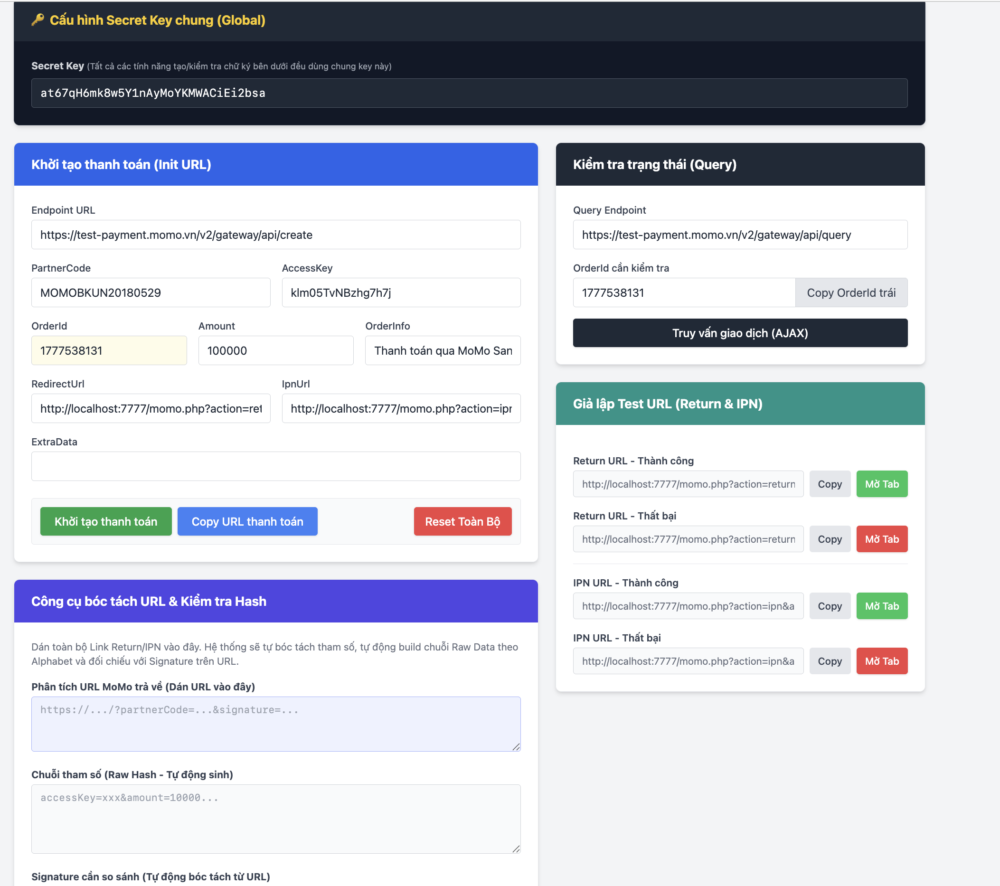
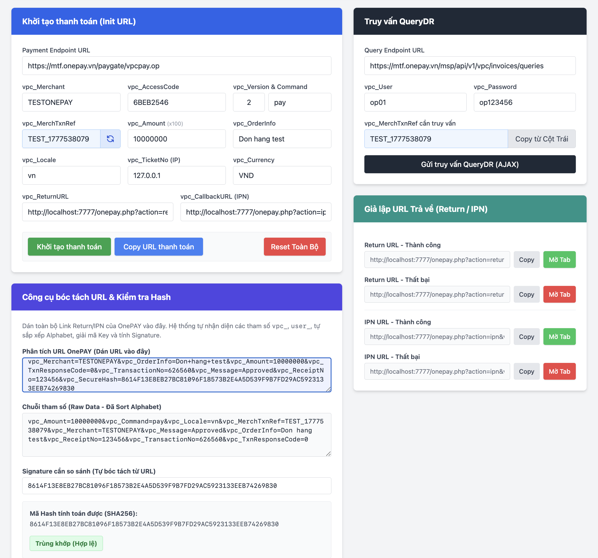

# Hướng Dẫn Sử Dụng - Tích Hợp Cổng Thanh Toán

Dự án này là bộ công cụ hỗ trợ người lập trình và kiểm thử chức năng giao dịch trên các cổng thanh toán phổ biến như **MoMo** và **OnePAY**. Được thiết kế dưới dạng All-in-One file, mỗi file (như `momo.php` và `onepay.php`) chứa trọn vẹn cả giao diện Frontend lẫn Backend (Khởi tạo giao dịch, Webhook/IPN, Return, Truy vấn QueryDR) để bạn dễ dàng hiểu và thực hành.

## 1. Cấu Trúc Thư Mục
- `index.php`: Trang chủ tự động liệt kê các cổng thanh toán và hướng dẫn truy cập nhanh.
- `momo.php`: Cổng thanh toán ví MoMo (QR Code / App).
- `onepay.php`: Cổng thanh toán thẻ OnePAY.
- `readme.md`: Tài liệu hướng dẫn sử dụng.
- `img/`: Thư mục lưu trữ hình ảnh tài nguyên.

## 2. Cách Chạy (Cài đặt)
1. **Yêu cầu máy chủ:** Môi trường PHP cơ bản hỗ trợ cURL. Có thể dùng XAMPP, MAMP, hệ thống như Laragon hoặc chạy trực tiếp bằng dòng lệnh:
   ```bash
   php -S localhost:8000
   ```
2. **Truy cập dự án:** Mở trình duyệt và vào đường dẫn: `http://localhost:8000` (Thay đổi cổng tùy vào máy chủ đang cấu hình). Trang chủ `index.php` sẽ mở ra.

## 3. Cách Sử Dụng Từng Cổng Thanh Toán
Mỗi tệp tin cổng thanh toán chứa các tính năng sau:
- **Khởi tạo thanh toán:** Điền thông tin Endpoint URL, Mã đối tác, Khóa bảo mật (Secret Key) và số tiền. Bấm "Khởi tạo thanh toán" để lấy link redirect ra cổng thanh toán thực tế của MoMo/OnePAY.
- **Giả lập URL Return/IPN:** Hệ thống tự động bóc tách và sinh ra đường dẫn giả lập cho thao tác thanh toán Thành Công hoặc Thất Bại để bạn dễ dàng test luồng code Backend mà không cần tốn tiền thanh toán thật.
- **Xác thực chữ ký:** Hỗ trợ tách và phân tích các tham số được trả về từ phía MoMo/OnePAY, tự động tính toán lại Token/Signature (Mã băm an toàn) chuẩn SHA256 cho bạn đối chiếu.
- **Truy vấn trạng thái đơn hàng (QueryDR):** Gửi cURL lên Server để lấy kết quả hiện tại của một giao dịch cụ thể đối chiếu theo Mã đơn hàng (OrderId).




## 4. Lưu Ý Quan Trọng
- Các thông số Sandbox (như Access Key, Secret Key, Merchant) được gắn sẵn trong code chỉ mang tính chất test. Tuyệt đối **không** dùng chúng trên API Thực tế (Production).
- Hãy đối chiếu tài liệu code trong tệp tin để ráp vào backend (Laravel/CodeIgniter/PHP thuần) của bạn tương ứng.
